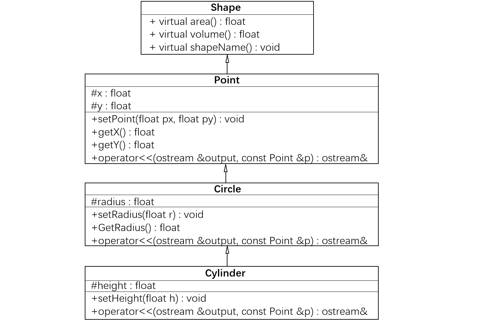
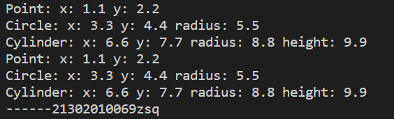

# Lab7 实验文档
## 回答问题
**虚函数的静态关联和动态关联有什么区别？**

确定调用的具体对象的过程称为关联，就是把一个函数名与一个类对象捆绑在一起，建立一个关联。一般来说，关联指把一个标识符和一个存储地址联系起来。
* 静态关联：在编译时即可确定其调用的虚函数属于哪一个类，例如函数重载和通过对象名调用的虚函数。由于是在运行前进行关联的，所以又称为早期关联。静态关联时，系统用实参和形参进行匹配，对于同名的重载函数便根据参数上的差异进行区分，然后进行编联。
* 动态关联：编译系统把它放在运行阶段进行处理，在运行阶段确定关联关系。也叫滞后关联。对于OOP而言，就是当对象接收到某一消息时，才去寻找和连接相应的方法。

**虚函数与纯虚函数有什么区别？**

* 虚函数的定义形式：virtual {}；纯虚函数的定义形式：virtual {} = 0。
* 虚函数可以被直接使用，也可以被子类重载以后，以多态的形式调用；而纯虚函数必须在子类中实现该函数才可以使用，因为纯虚函数在基类有声明而没有定义。
* 虚函数在子类里面可以重载也可以不重载的；但纯虚必须在子类中实现。

**上述设计是否存在问题？如果有问题，应该如何改进？如果没有问题，说明这样设计的合理性或意义。**

没有问题。合理性如下：

用继承的方式创建类，主要优点在于代码的可重用性和可读性。当子类继承父类的属性和函数时，我们不需要在子类中再次编写相同的代码。这使得重用代码变得更容易，使我们编写更少的代码，代码变得更具可读性。在本次lab中，名称、面积、体积是所有图形共有的操作，在基类声明即可，子类则根据需求重写函数。x、y是点、圆、圆柱共有的属性，在点类中声明即可，圆和圆柱会继承该属性，不用重复声明。

把基类写成抽象类，可以实现多态。多态的优点在于应用程序不必为每一个派生类编写功能调用，只需要对抽象基类进行处理即可。且派生类的功能可以被基类的方法或引用变量所调用，这叫向后兼容，可以提高可扩充性和可维护性。在本次lab中，定义一个指向基类 Shape 的指针，就可以通过基类指针分别指向point，circle，cylinder这三个变量，来调用这三个变量的成员函数，非常方便。

## 实现思路
### 类的设计
1. 基类 Shape，为图形类。抽象了图形的名称、面积、体积等函数。
   * 名称函数shapeName():纯虚函数。需要在派生类中实现。
   * 面积函数area()：虚函数。由于成员变量不全，无法设计公式计算，所以返回0.0
   * 体积函数volume()：虚函数。由于成员变量不全，无法设计公式计算，所以返回0.0
2. Point 类继承自 Shape。
   * 有自己的虚函数 shapeName（继承自基类的纯虚函数），输出“Point：”。
   * 添加了 protected 的 x , y 成员变量表示坐标，并允许子类继承。
   * 定义了构造函数，初始化成员变量 x , y 。
   * 添加了成员函数 setPoint，getX，getY ，分别用于设置坐标，获得x, 获得y。
   * 重载了输出流运算符用于 Point 类的输出，分别输出x , y 两个成员变量。
3. Circle 类继承自 Point。
   * 有自己的虚函数 shapeName（继承自基类的纯虚函数），输出“Circle：”。
   * 添加了 protected 的 radius 成员变量表示半径，并允许子类继承。
   * 定义了构造函数，初始化成员变量 x , y , radius 。
   * 添加了成员函数 setRadius，GetRadius，分别用于设置半径，获得半径。
   * 重载了输出流运算符用于 Circle 类的输出，分别输出x , y , radius 三个成员变量。
4. Cylinder 类继承自 Circle。
   * 有自己的虚函数 shapeName（继承自基类的纯虚函数），输出“Cylinder：”。
   * 添加了 protected 的 height 成员变量表示半径，并允许子类继承。
   * 定义了构造函数，初始化成员变量 x , y , radius ,height 。
   * 添加了成员函数 setRadius，GetRadius，分别用于设置半径，获得半径。
   * 重载了输出流运算符用于 Cylinder 类的输出，分别输出x , y , radius ,height四个成员变量。

### 调用部分
* 实例化三个类。
* **静态关联**：调用各自的 shapeName 函数，并通过输出流输出变量的成员信息。
* **动态关联**：定义一个指向基类 Shape 的指针，通过基类指针分别指向这三个变量，来调用这三个变量的成员函数并打印变量的成员信息，即实现了多态。
## 运行结果截图
